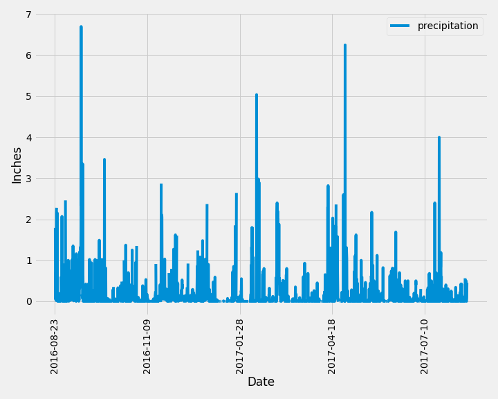
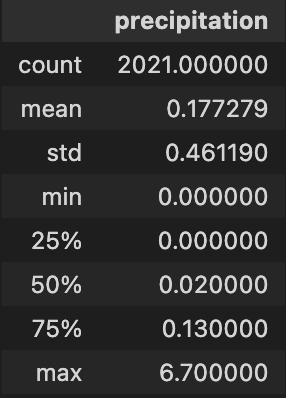
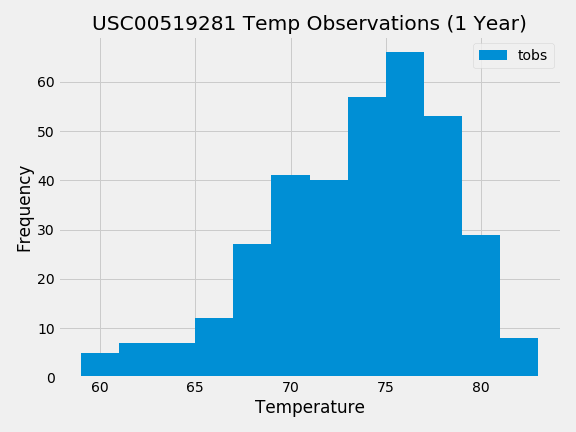
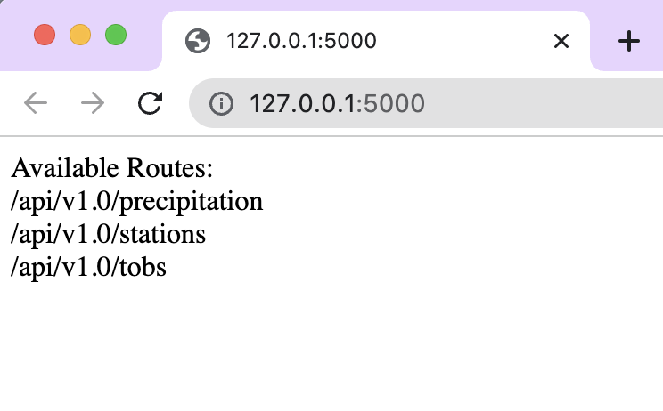
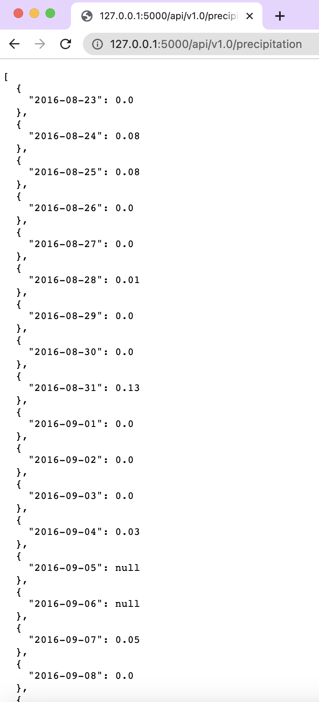
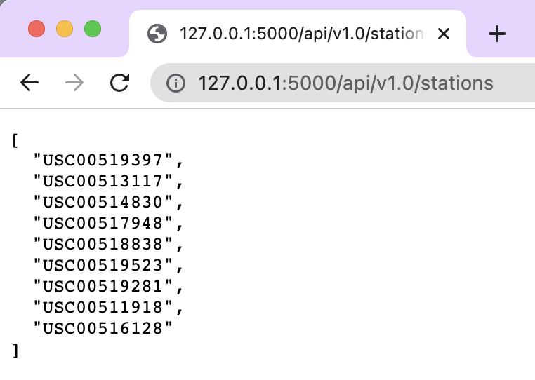
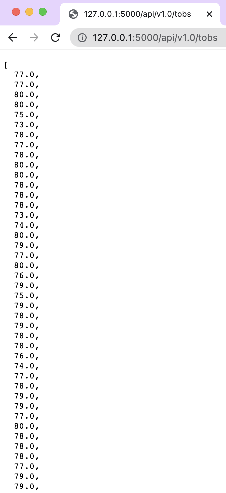
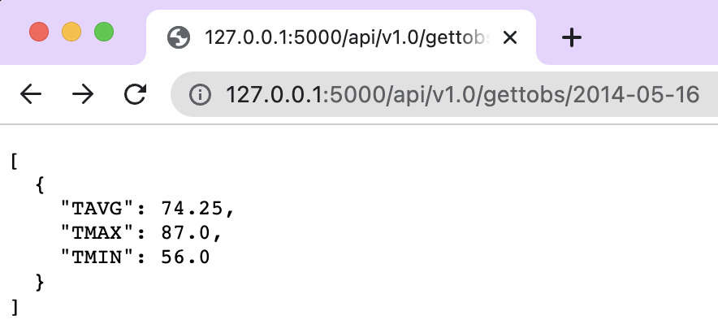
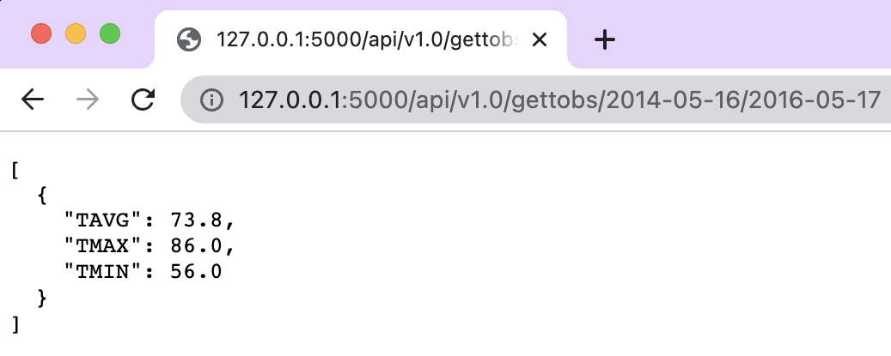

# SQL-Challenge
## Glen Dagger
### Module 10 Challenge

---
## Part 1: Analyze and Explore Climate Data

- Used SQLAlchemy ORM to reflect 'measurement' and 'station' tables from the hawaii.sqlite database into jupyter notebook as Measurement and Station table references
### Precipitation Analysis
- Performed query to find most recent date in Measurement table
- Performed query to filter Measurement table down to only the precipitation and date columns for the most recent year of data
- Saved results into a Pandas dataframe as "precipitation_df"
- Used Pandas plotting with MatPlotLib to plot precipitation data for previous year as a line graph

- Used Pandas describe method to calculate summary statistics for precipitation data

### Station Analysis
- Performed query to count the number of distinct stations in the Station table (9).
- Performed query to list stations by number of observations in descending order to find the most active station (station ID 'USC00519281').
- Performed queries using the '.func' function to find the lowest (54.0), highest (85.0), and average (71.66)temperatures recorded by the most active station in the last year of data
- Performed query to filter Measurement table to the last year of temperature observation data
- Saved results to Pandas dataframe as 'tobs_df'
- Used Pandas plotting with MatPlotLib to create histogram of tobs data with 12 bins

---
## Part 2: Design Climate App
- Created engine to hawaii.sqlite and reflected 'measurement' and 'station' tables into SQLAlchemy ORM
- Set up Flask in app.py and created homepage route that lists all available API routes.

-Created route that returns JSON representation of all precipitation data from the Measurements table over the last year using the date column as keys and precipitation column as values.

- Created route to return JSON list of all station IDs.

- Created route that returns JSON list of tobs information from the Measurement table over the previous year.

- Created route that returns the lowest, highest, and average temperatures over a specified range. This requires the user to go to the "/api/v1.0/gettobs/" URL and enter a start date (YYYY-MM-DD) and optional end date. The default end date is set to the most recent date in the database.

